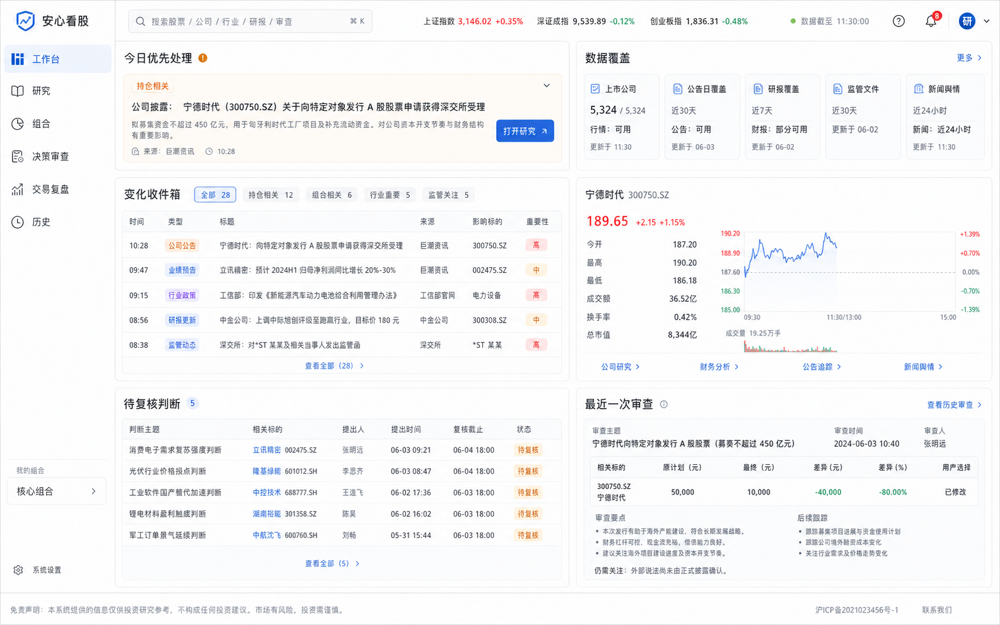

# 安心看股桌面产品与 UI/UX 架构

## 高保真视觉基准



该图只定义页面密度、布局、层级、色彩和组件关系，不定义真实产品数据。图中的公司、数字和事件不得写死进代码；实现必须使用用户持仓、真实接口或明确空状态。任何原型中可能出现的目标价、审批意味或买卖倾向文案均不采用。

## 设计目标

让用户在首屏 10 秒内回答三件事：今天哪里发生了变化、这与我的持仓有什么关系、下一步该打开哪一项继续核实。界面不使用口号解释价值，价值由真实任务、数字和来源直接呈现。

## 一级导航

| 导航 | 用户问题 | 包含能力 |
|---|---|---|
| 工作台 | 今天先看什么？ | 变化收件箱、待复核判断、数据覆盖、最近审查 |
| 研究 | 这只股票发生了什么？ | 股票研究、财报体检、结构化研究 Agent |
| 组合 | 我真正暴露在哪里？ | 普通持仓、行业暴露、ETF 穿透与重复持仓 |
| 决策审查 | 这笔计划还有什么没想清楚？ | 理由拆解、证据核实、仓位与情景损失 |
| 交易复盘 | 过去的结果来自哪里？ | CSV、FIFO、费用、行为规则、复盘报告 |
| 历史 | 我的判断后来怎样了？ | 决策记录、证据快照、到期复核、匿名导出 |

设置、语言、隐私和数据删除进入左下角用户菜单。ETF 与财报不再占用一级导航。

## 全局桌面骨架

```text
┌──────────────┬─────────────────────────────────────────────────────────────┐
│ 品牌 / 搜索   │ 全局股票搜索     数据状态     最近更新时间     用户菜单      │
├──────────────┼─────────────────────────────────────────────────────────────┤
│ 工作台        │                                                             │
│ 研究          │ 当前页面工作画布                                             │
│ 组合          │                                                             │
│ 决策审查      │                                                             │
│ 交易复盘      │                                                             │
│ 历史          │                                                             │
│              │                                                             │
│ 数据与隐私    │                                                             │
└──────────────┴─────────────────────────────────────────────────────────────┘
```

- 左侧导航 224px；顶栏 64–72px；内容最大宽度不硬性限制，但主阅读列控制在 760–920px。
- 页面标题只说明当前任务，例如“组合暴露”“财报体检”，不写营销副标题。
- 顶栏搜索支持代码、名称、空格、交易所后缀和最近搜索。

## 工作台

```text
┌──────────────────── 今日优先处理 ────────────────────┬──── 数据覆盖 ────┐
│ 招商银行发布正式披露 · 与“息差企稳”判断相关           │ 行情 3/3          │
│ 来源 / 时间 / 一句影响说明             [打开研究]     │ 公告 3/3          │
└───────────────────────────────────────────────────────┴──────────────────┘
┌──────────────────── 变化收件箱 ──────────────────────┬──── 待复核 ──────┐
│ 类型  标的  发生了什么  对原判断影响  来源  时间       │ 判断 / 触发点     │
│ ...                                                   │ ...              │
└───────────────────────────────────────────────────────┴──────────────────┘
┌──────────────── 最近一次审查 ─────────────────────────┬──── 组合摘要 ────┐
│ 原金额 → 最终金额 / 冲突变化 / 下一复核点              │ 最大持仓 / 暴露   │
└───────────────────────────────────────────────────────┴──────────────────┘
```

空持仓时用一个两步 Empty：`导入持仓`、`先研究一只股票`。禁止显示默认三只股票或虚构今日新闻。

## 研究中心

### 研究页结构

```text
┌──────── 标的栏 ────────┬──────────────── 主研究区 ────────────────┬──── 下一步 ────┐
│ 搜索                   │ 公司 / 价格 / 更新时间 / 数据状态          │ 当前持仓         │
│ 最近研究               │ [概览][价格事件][财报体检][证据链][问题] │ 计划操作         │
│ 自选/持仓               │                                         │ [进入决策审查]   │
│                        │ 当前标签内容                            │ 保存我的判断     │
└────────────────────────┴─────────────────────────────────────────┴─────────────────┘
```

“研究 Agent”是主研究区右上角的任务入口。用户输入“分析最新财报现金流为什么变差”，随后页面展开任务抽屉：

1. 已识别意图；
2. 将检查的 3–5 个任务；
3. 每项任务的数据状态；
4. 有引用的结构化简报；
5. 带入决策审查或保存为待复核问题。

不做聊天气泡和历史对话侧栏。

### 财报体检布局

```text
┌──────── 关键勾稽结论 ─────────────────────────────────────────────┐
│ 经营现金流 / 净利润 0.42 · 低于规则阈值 0.50 · 2026Q1 · 来源      │
└───────────────────────────────────────────────────────────────────┘
┌──────── 趋势图（营收/利润/现金流） ─────────┬──── 异常检查 ────────┐
│ 4–8 期折线 + 数值表                          │ 现金流匹配           │
│ 报告期切换                                  │ 应收增速             │
│                                             │ 债务压力             │
└─────────────────────────────────────────────┴─────────────────────┘
┌──────── 指标明细 ───────────────────────────┬──── 同业位置 ────────┐
│ 指标 / 当前 / 上期 / 同比 / 口径 / 来源       │ 有数据才显示          │
└─────────────────────────────────────────────┴─────────────────────┘
```

没有同业数据时整块写“尚未接入可靠同业口径”，不生成假分位。

## 组合中心

顶部在“持仓概览 / ETF 穿透”之间切换，但共享同一组资产。

- 首行显示总记录金额、最大单一暴露、最大行业暴露、数据覆盖日期。
- 主要视觉用水平暴露条和 ETF×底层股票重合矩阵。
- ETF 详情用抽屉展示前十大持仓、披露期和数据口径。
- 风险提示使用“数值 + 阈值 + 涉及资产”，例如“电子行业底层暴露 43%，超过个人提醒值 35%”。
- 每个风险行提供“查看来源”与“用这项风险开始审查”。

## 决策审查

保持两栏，不使用向导式大空白页面。

主画布顺序：

1. 股票、操作、金额、理由、失效条件；
2. 操作前后仓位条；
3. 10%/20%/30% 下跌情景条；
4. 原话与结构化理解并排确认；
5. 数字冲突和缺失项；
6. 用户修改结果。

右栏顺序：

1. 当前持仓与个人边界；
2. 证据覆盖与核实结论；
3. 3 条最相关来源；
4. 仍未回答的问题。

底部固定 `维持计划`、`修改金额`、`稍后再看`。三者视觉权重接近，不把任何选择暗示为正确答案。

## 交易复盘

- 左侧 360px 导入与字段映射，右侧为结果。
- 结果顶部只显示 4 个确定值：记录数、已实现盈亏、费用、未平仓标的。
- 主区为交易时间轴与持仓表；侧区为规则信号。
- AI 报告放在确定性结果之后，逐段链接它所引用的计算项。
- “写入提醒规则”必须先展示变更前后并由用户确认。

## 历史

- 默认表格，不做仪表盘首页。
- 列：时间、标的、操作、原金额、最终选择、触发冲突、证据状态、复核日期。
- 详情侧栏保留当时的原话、结构化理解、规则快照、来源快照和前后金额。
- 顶部只保留两个有行动价值的统计：计划改变率、到期未复核数；没有记录时不显示百分比。

## 组件与图表清单

优先复用 shadcn：Button、Input、Command、Tabs、Card、Table、Badge、Alert、Dialog/Sheet、Tooltip、Skeleton、Empty、Separator、Progress。表单按 Field/FieldGroup 组织，加载使用 Skeleton，不手写假脉冲块。

新增业务组件：

- `DataProvenance`：来源、时间、模式和口径；
- `CoverageStrip`：多个数据源覆盖状态；
- `PositionDeltaBar`：操作前后仓位与阈值；
- `ScenarioLossBars`：下跌情景金额；
- `EvidenceTimeline`：来源类型与匹配状态；
- `FinancialTrendChart`：指标趋势与表格替代；
- `ExposureMatrix`：ETF 与底层股票重合；
- `AgentTaskTrace`：任务、数据状态、引用和失败项。

禁止无阈值的仪表盘评分。若没有 OHLC 数据，使用折线图而不是伪 K 线。所有图表在图形之外提供关键数值。

## UI 完成验收

- 1440×900 首屏无需滚动即可看到页面核心任务和主操作。
- 1100px 宽度无横向溢出，次要侧栏可折叠。
- 页面中没有大口号、开发说明、AI 自我介绍和重复免责声明。
- 任何实时结论都能看到来源与时间；没有数据时不显示样例数字。
- 搜索、加载、空结果、接口失败、部分数据和缓存状态都有完整设计。
- 键盘焦点清楚；正文 ≥14px；辅助文字 ≥12px；对比度达到 WCAG AA。
- 红绿只表示价格涨跌；规则冲突用琥珀色 + 图标 + 数值阈值。
- ETF、财报、复盘和决策审查共享同一应用栏、导航、字体、间距和状态系统。
