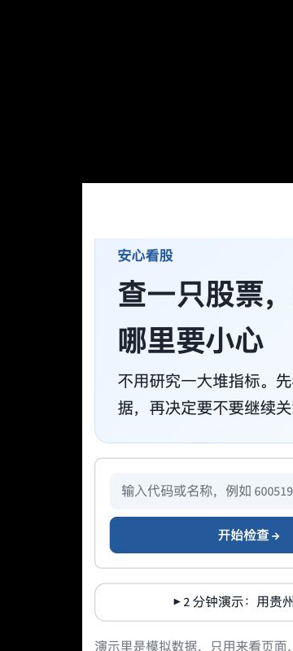
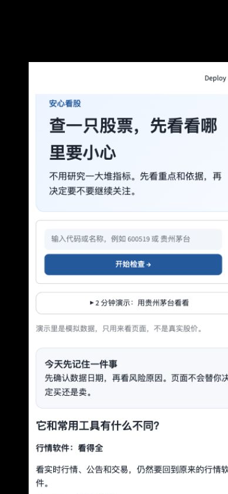
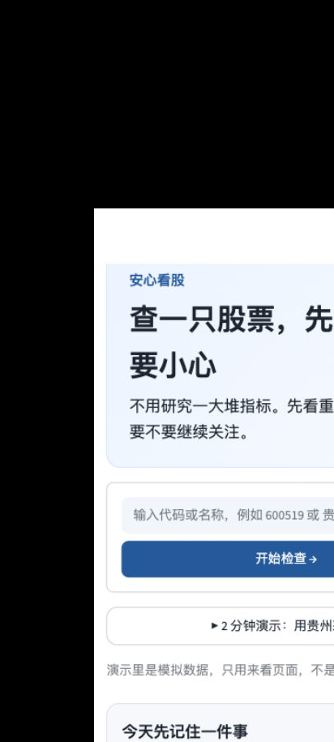
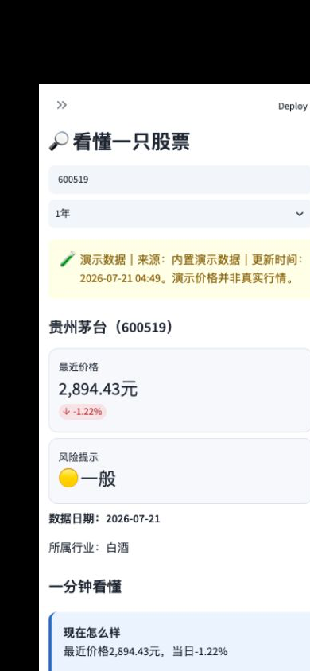

# Market Clarity · 安心看股

**Market Clarity** 是产品英文名，“安心看股”是中文品牌。它是面向 A 股普通投资者的股票研究与决策验证工作台：先把趋势、量价、关键位置、阶段表现、基本面与主要风险整理成可读结论；当用户准备交易时，再用个人规则和情景计算帮助验证计划。

它不帮用户选股票，不连接证券账户，不自动交易，不预测确定性涨跌，也不构成投资建议。

默认使用真实公开数据，零 Token 即可运行。数据按 AKShare 在线接口 → 最近缓存 → 明确标记的备用模拟资料依次回退；只有手动开启演示模式时才固定使用演示数据。

## 产品与代码入口

- [`web/`](web/)：正式桌面 Web 产品，包含统一导航、股票研究、决策验证、ETF 诊断、量化研究、交易复盘、全局 AI 助手、情境指引和 90 秒产品演示；
- [`web/TECHNICAL_ARCHITECTURE.md`](web/TECHNICAL_ARCHITECTURE.md)：Web 架构、数据来源、AI 降级、安全边界和模块状态；
- `api.py`、`src/`：Python 数据、规则、归因和兼容服务；
- `app.py`、`pages/`、`static/`：Streamlit 兼容入口及轻量工具页面；
- `tests/`、`web/tests/`：后端与桌面前端的自动化验证。

默认分支 `main` 保存当前稳定代码。短期功能分支合并后删除；稳定里程碑才创建 Release 或版本标签。

## 核心使用流程

产品先提供可追溯的股票研究，再在用户准备行动时进入决策验证：

```text
搜索股票 → 阅读核心结论、市场温度与关键位置 → 查看量价和阶段表现
→ 发起决策验证 → 计算仓位和亏损情景 → 维持、修改或暂缓
```

## 已实现功能

- 首页工作台：首屏展示三大指数、股票分析与交易前检查两个核心入口，并汇总持仓、个人规则和最近一次检查。
- 智能研判驾驶舱：把市场温度、趋势结构、量价关系、财务质量、主要风险和关键位置集中在一个页面。
- 阶段表现：按近 5/20/60/120 个交易日展示区间变化，帮助用户区分短期波动与中期结构。
- 研究历史：保留最近研究过的股票，便于快速回看，不需要每次重新搜索。
- 个人风险边界：可投资资金、单股/行业/单笔上限、亏损承受、借款规则和自愿冷静期。
- 交易计划：股票、买入/补仓/卖出、金额、持有期限、理由、来源、失效条件和当前状态。
- JSON 结构化理由解析：优先使用可选 OpenAI Structured Outputs；无 Key 或调用失败时自动使用本地规则。
- 模糊计划待明确：只描述行业或“感觉能赚钱”时，不猜测标的和金额；先请用户补全具体股票、计划金额和失效条件。
- 受控 RAG + 公告核实：从小型风险知识库检索解释，并通过 AKShare 检索近 180 日公告标题。即使关键词命中也只标记“可能相关披露”，要求打开原文；不会把“未找到”误写成“已经证伪”。
- 按需近实时公开信息：Python 在生成审查或用户点击刷新时获取个股新闻和公告，去重、按 24 小时/7 天/30 天筛选，并区分正式披露、媒体报道和市场观点。
- 有证据边界的 LLM 整理：只向模型发送最多 5 条已检索资料的标题、摘要、来源和时间；结论必须引用证据编号。无 Key 时使用确定性规则整理。
- 确定性规则引擎：计算计划后单股/行业比例、下跌 10%/20%/30% 情景、规则冲突和信息完整性。
- 市场证据快照：用真实、缓存或演示价格计算近 5/20/60 日变化、MA20 距离、20 日量比、RSI、距 60 日高点和波动；每项同时说明“它不能证明什么”。
- 决策记录：保存原计划、规则冲突、用户选择和修改后金额，并支持 CSV 导出。
- 90 秒产品演示：预制科技股补仓案例，展示结构化解析、证据缺口、42% 单股仓位和修改前后变化。
- 匿名用户测试：生成测试编号，记录用时、风险认可、最终选择、满意度、复用及付费测试意愿，并导出 CSV。
- 中英界面：侧边栏可在中文与 English 之间切换，首页、统一导航、股票分析容器和核心决策入口会同步更新。
- 统一股票分析入口：`daily_stock_analysis` 在安心看股的产品外壳内打开，始终保留返回首页与独立窗口入口；服务未连接时自动回退内置分析。

## 辅助功能

- 今日概览：三大指数、自选股、持仓和重要提醒。
- 个股分析：代码/名称搜索、1个月至3年 K 线、成交量、MA5/20/60、RSI、MACD、布林带、基本面趋势和通俗解释。
- 透明风险规则：ST/退市标识、快速涨跌、波动、成交量、数据过期、负债、利润、现金流；每条显示证据、日期和规则编号。
- 自选股：添加、删除、备注、优先级、卡片/表格、筛选和刷新。
- 持仓：手工录入、市值、盈亏、仓位、图表、CSV 导入和导出。
- 交易日志：操作理由、风险、证伪条件、结果、复盘和基础统计。
- 访问密码：`APP_PASSWORD` 存在时使用服务器端会话校验，密码不进入 URL 或网页代码。
- 数据和隐私页面，以及自动化测试。

手机基线和改进后截图位于 `docs/screenshots/mobile_baseline/` 与 `docs/screenshots/mobile_final/`，覆盖 360×800、390×844、412×915。当前版本可直接运行查看完整界面。

| 360×800 首页 | 390×844 首页 | 412×915 首页 |
|---|---|---|
|  |  |  |



## 项目结构

```text
web/                    Market Clarity 桌面 Web 产品（vinext + React）
app.py                 首页
pages/                 个股、自选股、持仓、日志、设置、隐私页面
src/decision_review/   JSON理由解析、受控检索、规则引擎与审查编排
src/data_providers/    AKShare/演示数据适配与回退
src/analytics/         技术指标和持仓计算
src/risk_engine/       确定性风险规则
src/database/          SQLite 和 CSV 备份恢复
src/ui/                通用界面、图表、Secrets 和密码门
src/services/          可供网页、API和未来移动端复用的业务服务
miniprogram_prototype/ 已冻结的微信小程序实验原型，不参与当前交付
tests/                 自动化测试
data/                  本地 SQLite 数据目录
.streamlit/            主题和 Secrets 模板
api.py                 最小 FastAPI 只读接口
static/                manifest、图标占位和离线说明页
```

路径通过项目目录或 `pathlib` 处理，兼容 Linux、macOS 和 Windows。代码中没有 API Key、Token、密码或数据库凭据。

## macOS 本地启动

建议安装 Python 3.11：

```bash
cd /你的路径/Stock
python3 -m venv .venv
source .venv/bin/activate
python -m pip install -r requirements.txt
python -m streamlit run app.py
```

浏览器打开 `http://localhost:8501`。也可在 Finder 双击 `run_mac.command`；首次需要联网安装依赖。

本地测试访问密码或可选 AI 时，复制模板并只在本机编辑：

```bash
cp .streamlit/secrets.toml.example .streamlit/secrets.toml
```

`secrets.toml` 已被 Git 忽略，绝对不要提交。

## Windows 本地备用启动

最终用户使用云端链接时不需要这些步骤。云服务不可用且需要本地备用时，先安装 Python 3.11，再双击 `run_windows.bat`，或在 PowerShell 运行：

```powershell
cd C:\你的路径\Stock
py -3.11 -m venv .venv
.venv\Scripts\Activate.ps1
python -m pip install -r requirements.txt
python -m streamlit run app.py
```

## 手机使用

部署后，最终用户只需在 Chrome、Edge 或 Safari 打开同一个 HTTPS 地址。手机宽度会自动：

- 隐藏 Streamlit 侧边栏；
- 使用“首页、检查、规则、记录、资料”底部导航；
- 把多栏内容改为单栏；
- 把主要按钮和输入框放大到约 48px 触摸高度。

添加到桌面：

- Android Chrome：右上角菜单 → **添加到主屏幕**或**安装应用**。
- iPhone Safari：底部分享按钮 → **添加到主屏幕**。

当前应称为“添加到桌面的手机网页”，不是完整离线 PWA。Streamlit 的 Service Worker、根路由与 WebSocket 限制详见 [PWA_LIMITATIONS.md](PWA_LIMITATIONS.md)。断网时不要依赖缓存行情。

## 独立后端接口

业务逻辑已从页面继续下沉到 `src/services/`。开发环境启动 API：

```bash
source .venv/bin/activate
python -m pip install -r requirements-dev.txt
uvicorn api:app --reload --port 8000
```

接口：

- `GET /health`
- `GET /stocks/search?q=茅台`
- `GET /stocks/600519/summary`
- `GET /stocks/600519/prices?days=366`
- `GET /stocks/600519/risks`
- `POST /v1/onboarding/parse`
- `POST /v1/decision/parse`
- `POST /v1/decision/review`

Streamlit 当前继续直接调用同一 service 层，避免额外网络故障。未来其他前端可以通过 HTTPS 调用 API，但本阶段不开发这些平台。正式对公网部署 API 前必须增加鉴权、限速、CORS 白名单和 `/v1` 版本路径。

## 上传到 GitHub

开发者需要 GitHub 账户；最终用户不需要。

1. 在 GitHub 新建空仓库，如 `anshin-stock`。建议设为 Private，并确认当前 Streamlit Community Cloud 套餐支持私有仓库。
2. 检查没有提交敏感文件：

```bash
git status
git check-ignore .streamlit/secrets.toml data/anshin.db
```

3. 提交并推送：

```bash
git add .
git commit -m "Create Anxin Stock Streamlit app"
git branch -M main
git remote add origin https://github.com/你的用户名/anshin-stock.git
git push -u origin main
```

## Streamlit Community Cloud 部署

只有开发者需要注册 GitHub 和 Streamlit Community Cloud。最终用户不需要注册这些账户，也不需要安装 Python、GitHub、Codex、股票软件或 AI 模型。

1. 开发者访问 Streamlit Community Cloud，用 GitHub 登录。
2. 选择 **Create app / Deploy an app** 并授权目标仓库。
3. Repository 选择仓库，Branch 选 `main`，Main file path 填 `app.py`。
4. Advanced settings 中选择 Python 3.11；仓库也包含 `runtime.txt`。
5. 在 **Settings → Secrets** 粘贴下方模板，并务必修改 `APP_PASSWORD`。
6. 点击 Deploy。部署完成后，把 `https://…streamlit.app` 链接和访问密码分别提供给测试用户。
7. 用户日常流程是：打开链接 → 输入访问密码 → 用自己的话设置规则 → 检查一笔交易计划。

### Secrets 配置模板

```toml
APP_PASSWORD = "换成一个只提供给测试用户的强密码"
OPENAI_API_KEY = ""
OPENAI_MODEL = "gpt-5.4-mini"
TUSHARE_TOKEN = ""

# 后续持久数据库配置示例；第一版不使用：
# [database]
# url = ""
# username = ""
# password = ""
```

可安全提交的模板在 `.streamlit/secrets.toml.example`。真实 Secrets 只能保存在 Cloud 设置或本机被忽略的 `secrets.toml`。

## 谁需要注册什么

| 项目 | 开发者 | 最终用户 | 必需性 |
|---|---:|---:|---:|
| GitHub | 需要，用于部署 | 不需要 | 云部署必需 |
| Streamlit Community Cloud | 需要，用于托管 | 不需要 | 云部署必需 |
| 访问密码 | 在 Secrets 设置 | 只需输入 | 强烈建议 |
| AKShare | 无账户 | 无账户 | 否，失败回退 |
| Tushare | 可选注册并配置 Token | 不需要 | 否 |
| OpenAI API | 可选注册并配置 Key | 不需要 | 否；第一版不依赖 |

## 数据来源和回退

1. 真实模式优先使用 AKShare 获取公开 A 股数据。AKShare 是第三方开源接口，字段和可用性可能变化。
2. Tushare Token 已预留在 Secrets；第一版尚未发起 Tushare 请求。
3. 在线数据初始化、请求或字段转换失败时，统一数据层先使用最近缓存；仍不可用时才回退明确标记的备用模拟资料并显示黄色状态。
4. 演示数据由固定随机种子生成，只用于体验，不能视为真实价格。

统一接口包括 `get_stock_list()`、`get_quote()`、`get_price_history()`、`get_financial_indicators()`、`get_company_profile()`、`get_market_indices()` 和 `get_announcements()`；结果均含来源、更新时间、演示标识和状态消息。

Streamlit Cloud 只安装根目录 `requirements.txt`；自动化测试和本地 FastAPI 开发才需要 `requirements-dev.txt`。

## 数据备份和恢复

Streamlit Community Cloud 的本地 SQLite 文件不是永久存储，重启或重新部署可能丢失数据。第一版请这样备份：

1. 新增或修改持仓后，到“持仓”页点击 **导出持仓 CSV 备份**。
2. 把 CSV 保存到个人电脑固定文件夹；文件含持仓信息，请勿公开上传。
3. 数据丢失时，在“持仓”页选择 CSV 并点击 **确认导入持仓**。
4. 导入为追加操作，重复导入前检查记录以避免重复。
5. 自选股和交易日志当前只在 SQLite；长期云端使用建议下一版接入托管数据库并增加完整备份。
6. 用户研究每完成一轮，就到“用户测试”页导出匿名 CSV；不要把含测试反馈的文件提交到公开仓库。

本地可在应用停止后复制 `data/anshin.db` 作完整备份，恢复时放回同一位置。

## 部署后检查清单

- [ ] 无密码不能进入核心页面；错误密码给出中文提示，密码不在 URL 中。
- [ ] 正确密码可进入首页；新浏览器会话重新验证。
- [ ] 90 秒演示可在关闭 AI Key 和实时数据时完整走通。
- [ ] 演示中 50,000 元计划显示单股 42% 与下跌 20% 影响 16,800 元。
- [ ] 修改为 10,000 元后显示单股 22%，并保留修改前后对比。
- [ ] 匿名测试可保存、导出 CSV 和删除，不要求姓名或账户信息。
- [ ] 首页显示来源、更新时间和演示/真实状态。
- [ ] 搜索 `600519` 或“贵州茅台”显示 K 线、成交量、MA、RSI、MACD。
- [ ] 在线数据失败时页面不崩溃，明确回退演示数据。
- [ ] 可添加自选股、录入持仓、计算盈亏和记录交易日志。
- [ ] 持仓 CSV 可下载并恢复测试记录。
- [ ] “数据和隐私”页可打开，且不出现完整 Token 或 Key。
- [ ] 分别用电脑 Chrome/Edge 和手机检查字体、卡片和图表。
- [ ] Streamlit Cloud 日志无未处理异常。

## 测试

```bash
source .venv/bin/activate       # Windows: .venv\Scripts\activate
python -m pytest
python -m compileall -q app.py pages src
```

当前验收：`61 passed`。除原有行情与持仓契约外，还覆盖智能研判驾驶舱、自然语言规则提取、理由分类、公告标题匹配的保守表达、新闻规范化、来源分类、去重、时间筛选、无 Key 证据整理、市场证据快照、42% 演示仓位、损失情景、严重表达停止审查、修改后审查持久化、匿名测试 CSV 和名称搜索容错。

## 常见错误排查

**空白页或启动失败**：确认 Python 3.11，重新激活虚拟环境并安装依赖；云端查看 Manage app → Logs。

**真实行情失败**：AKShare 可能临时限流或字段变化。应用会回退演示数据；稍后重试或暂时启用演示模式。

**密码页没有出现**：`APP_PASSWORD` 未配置或 Secrets 格式错误。到 Cloud 的 Settings → Secrets 设置并重启。

**云重启后持仓消失**：Cloud 本地磁盘不保证持久化。使用持仓 CSV 恢复，重要数据不要只留一份。

**PowerShell 禁止激活脚本**：直接运行 `.venv\Scripts\python.exe -m streamlit run app.py`，无需修改系统策略。

## 已知限制

- AKShare 可能限流、停用或改变字段；实时基础资料和财务覆盖不如专业终端。
- Tushare 只预留 Secrets；OpenAI 为可选结构化解析路径，未配置或失败时自动使用本地规则。
- 同行完整比较未开放，应用不会伪造同行数据。
- 总资产历史需要可靠快照；第一版不连接券商，所以不虚构历史曲线。
- Community Cloud 的 SQLite 不适合长期持久化，目前只提供持仓 CSV 备份恢复。
- 访问密码是轻量访问门，不替代正式用户身份认证；不要存放高度敏感信息。

## 隐私和免责声明

不要填写证券账户密码、身份证号、银行卡号或短信验证码。本应用不连接证券账户，持仓和计划由用户手填。云部署使用 Streamlit Community Cloud；真实模式访问 AKShare 公开数据接口。启用 OpenAI 时，规则描述和交易理由会发送到 OpenAI API 做结构化解析，具体字段见 [隐私数据地图](PRIVACY_DATA_MAP.md)。

风险等级依据有限公开数据和预设规则生成，仅用于信息排序，不代表未来收益或损失概率。所有 AI 输出（如后续启用）必须注明：“以下为基于现有数据的辅助整理，不构成投资建议。”

## 后续路线

1. 接入持久托管数据库，为自选、持仓和日志提供完整导入导出。
2. 完善 Tushare 备用源、磁盘缓存和交易日历。
3. 增加公告结构化摘要，并严格限制 AI 只使用已获取事实。
4. 增加持仓快照后再提供真实总资产变化图。
5. 增加完整无障碍、手机端和云端端到端测试。

## 新增设计与小程序文档

- [自然语言首次设置](NATURAL_LANGUAGE_ONBOARDING.md)
- [规则与交易 JSON Schema](RULE_JSON_SCHEMA.md)
- [微信小程序原型架构](MINIPROGRAM_ARCHITECTURE.md)
- [微信小程序发布要求](MINIPROGRAM_RELEASE_REQUIREMENTS.md)
- [隐私数据地图](PRIVACY_DATA_MAP.md)
