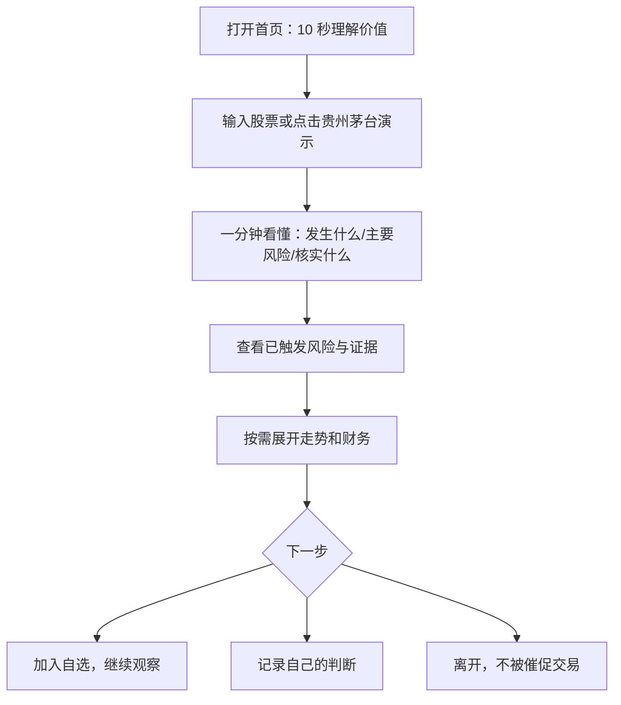

# 2 分钟价值演示与用户流程

## North-star journey

## 为什么这样设计

1. **先回答问题，再提供数据。** 普通用户不是为了看 K 线而来，而是想知道“这只股票现在有什么值得注意”。
2. **风险优先于机会。** 产品定位不是荐股，首要价值是减少遗漏和冲动。
3. **渐进披露。** 走势、财务和完整规则仍在，但只有用户需要证据时才展开。
4. **以行为结束。** 最终动作不是买卖，而是观察、记录或离开，符合产品承诺。
5. **不虚构 AI。** 当前“一分钟看懂”由规则生成；未来 AI 只能改写，不能决定结论。

## 2 分钟课堂 Demo Script

| 时间 | 操作 | 要说的话 | 价值证据 |
|---:|---|---|---|
| 0:00–0:15 | 打开首页 | “这不是交易软件，是普通投资者做决定前的检查表。” | 首屏价值主张 |
| 0:15–0:25 | 点击贵州茅台演示 | “不需要注册或配置 AI。” | 一键进入固定场景 |
| 0:25–0:55 | 读一分钟总结 | “先告诉你发生什么、风险和下一步核实。” | 认知负担下降 |
| 0:55–1:20 | 展开风险证据 | “每条提示都能追到数据和规则，不靠模型猜。” | 可解释与信任 |
| 1:20–1:40 | 看走势/财务 | “需要时才看细节，不用先读几十个数字。” | 渐进披露 |
| 1:40–2:00 | 加入自选或记录判断 | “产品不催交易，帮助你观察和复盘。” | 行为改变 |

## First-use journey

- 入口：家庭网页链接。
- 身份验证：输入家庭密码。
- 首屏成功标准：10 秒内能说出“它帮我整理重点和风险”。
- 首任务：不借助指导找到搜索框并完成股票检查。
- 价值时刻：能准确复述至少一个风险及触发依据。
- 结束：选择继续观察、记录判断或退出。

## Returning-user journey

- 首页直接看“我的关注”和持仓摘要。
- 只对有新数据或风险变化的股票发起复查。
- 每周一次回看交易理由，而不是每天增加使用时长。

## 明确不进入 Demo 主线

- 设置 Token。
- 查看全部技术指标。
- 导入 CSV。
- 配置颜色或缓存。
- 讲解底层数据适配与数据库。

这些是工程保障，不是评委或用户首先购买的价值。

